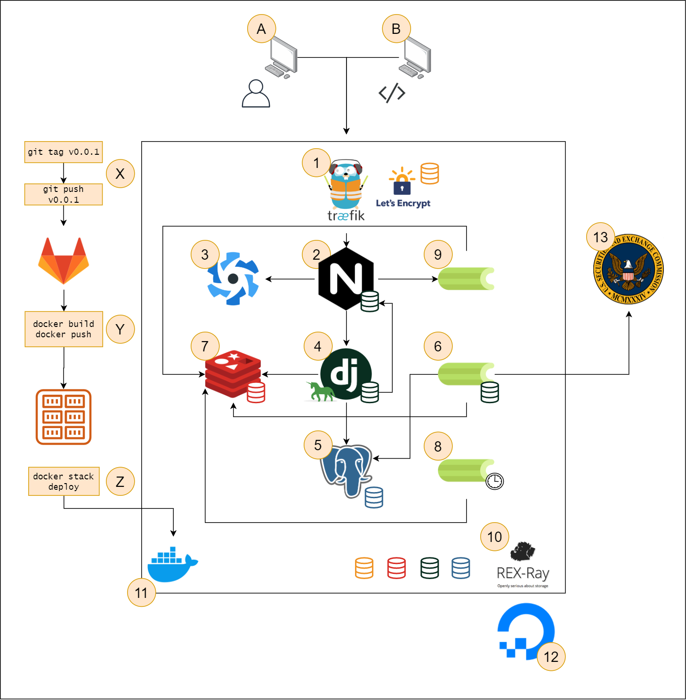

# SEC Data project

This repo contains code for a web application that allows users to view SEC Filing data. The application downloads public data from SEC.gov every quarter and builds these filings into a database (PostgreSQL). The backend web application that interacts with the database is made with the Django web framework an several additional Django packages including celery and Django REST Framework. Primarily serving as a REST API, the Django application data is consumed by a Vue.js application that users can access in their browser over the internet. Users can also signup for an account and request credentials to access the same public API that the Vue.js application requests data from.

This project is open source and anyone is welcome to contribute or create issues and merge requests.

## Local development

To run this application on your local computer, you can use docker and docker-compose.

Before running the project, you must create a file in the root directory called `.env`. This file will provide values to docker-compose that you do not want to commit to source code, so `.env` is not committed to version control (git). The only sensitive data is a OAuth2 client keys for the Linkedin OAuth2 application that you may choose to setup if you wish to test social authentication in your local environment, but this is not required, so you can add placeholder values for these variables. See `.env.template` for more information about setting up OAuth2 keys with a Linkedin OAuth2 application.

Once you have created `.env`, run the following command:

```
docker-compose up
```

This will start the project locally. It may take some time build the docker images. When everything has finished, visit `http://localhost` in your browser and follow the instructions there for completing the setup of you local environment.

You can check the logs of `docker-compose up`, you should make sure that no service failed to start.

Additional project documentation is coming soon.

## Architecture overview



## Application Entrypoints

The application can be accessed either through a web UI (A) or programmatically through a public API (B).

A. Requests coming from the web UI are authenticated using Django Session authentication (HttpOnly cookies).

B. API requests can be made with an API token (from Django Token Authentication).

## Main Application Architecture

1. The Traefik container exposes ports 443 and 80 for HTTPS and HTTP traffic. HTTP requests are redirected to HTTPS requests. Traefik uses Let's Encrypt to issue TLS certificates that allow connections to the application to use HTTPS.

2. All traffic from Traefik is routed to NGINX which handles traffic based on the URL path. `/api/*` and `/admin/*` requests are handled by Django/gunicorn, `/flower/*` requests are handled by the flower service and all other requests will be served by the Vue/Quasar application.

3. Quasar Framework SPA/PWA makes API requests using Axios.

4. The main Django application handles both requests for the main API and the Django admin. The main API is built with Django REST Framework.

5. The API pulls data from a PostgreSQL database that runs in a container.

6. The main celery worker has the same image as the Django web application. It handles asynchronous background tasks such as pulling filing data from SEC.gov and adding database records from the processed filing data.

7. Redis serves as both as a caching layer to cache large/expensive requests and it is also the broker for celery. New tasks are stored in Redis and celery (6) continually monitors redis for new tasks that it can work on.

8. Celery beat is in charge of scheduling tasks to be executed by celery. For example, once per day celery may query SEC.gov for a new filing.

9. Flower is a celery monitoring utility that can be used to view the currently executing tasks as well as completed and failed tasks.

10. REX-Ray is a docker volume plugin that automatically provisions DigitalOcean block storage devices to be used in our application. There are four volumes provisioned in this application to persist data in various places: Let's Encrypt Certificates, Redis data, Django static/media files and Postgres data. The Django static/media volume is shared between the NGINX container, the Django container and the celery container.

11. The main architecture runs on a single DigitalOcean droplet that uses a Docker machine image that runs in swarm mode.

12. A DigitalOcean account is required for this architecture. The minimum cost of this architecture is between $5 and $6/month.

13. The sample application that uses this architecture (linked below) access public data from SEC.gov.

## CI/CD Pipeline with GitLab

X. A developer creates and pushes a git tag.

Y. Pushing this tag triggers a GitLab CI pipeline (defined in `.gitlab-ci.yml`) which builds the two main images used in our application (images for the frontend and backend) and then pushes these images to our private GitLab registry that is comes with all GitLab projects.

Z. The deployment command `docker stack deploy` references the `stack.yml` file which defines all of the services, networks and volumes used in the main architecture.

## Links

- GitLab repository: [https://gitlab.com/briancaffey/sec-filings-app](https://gitlab.com/briancaffey/sec-filings-app)
- GitHub repository (mirror): [https://github.com/briancaffey/sec-filings-app](https://github.com/briancaffey/sec-filings-app)
- Project URL: [opensecdata.ga](https://opensecdata.ga)
